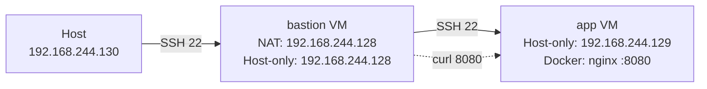

# 期中實作 — 411630907 洪振凱

## 1. 架構與 IP 表


## 2. Part A：VM 與網路
| VM | 網卡 | 模式 | IP |
|---|---|---|---|
| bastion | NIC 1 | NAT | 192.168.29.128 |
| bastion | NIC 2 | Host-only | 192.168.244.128 |
| app | NIC 1 | Host-only | 192.168.244.129 |
| host | NIC 1 | Host-only | 192.168.244.130 |

## 3. Part B：金鑰、ufw、ProxyJump
### bastion ufw status


### app ufw status


### ssh app


## 4. Part C：Docker 服務


## 5. Part D：故障演練
### 故障 1：F1
- 注入方式：關閉 app `Host-only` 網卡
    ```bash
    sudo ip link set ens33 down
    ```
- 故障前：
    - **Host:** `ssh app` 可以正常連線
    - **Host:** `ping 192.168.244.129` 正常
    
- 故障中：
    - **Host:** `ssh app` timeout
    - **Host:** `ping 192.168.244.129` 不通
    
- 回復後：
    將 app 網卡重啟 `sudo ip link set ens33 up`
    - **Host:** `ssh app` 可以正常連線
    - **Host:** `ping 192.168.244.129` 正常
    
- 診斷推論：
    **本次故障為網路層問題**
    - 判斷依據：
        1. `ping` 無法連線 → 表示問題發生在 L2/L3
        2. 檢查 `ip link` 發現網卡為 DOWN
        3. 因此確定為網卡關閉導致

### 故障 2：F2
- 注入方式：移除 app SSH 允許規則
    ```bash
    sudo ufw default deny incoming
    sudo ufw delete allow 22/tcp
    ```
- 故障前：
    - **Host:** `ssh app` 可以正常連線
    - **Host:** `ping 192.168.244.129` 正常
    
- 故障中：
    - **Host:** `ssh app` timeout
    - **Host:** `ping 192.168.244.129` 正常
    
- 回復後：
    重新允許 bastion SSH `sudo ufw allow from 192.168.244.128 to any port 22 proto tcp`
    - **Host:** `ssh app` 可以正常連線
    - **Host:** `ping 192.168.244.129` 正常
    
- 診斷推論：
    **本次故障為防火牆問題**
    - 判斷依據：
        1. `ping` 可以通 → 網路層正常
        2. `ssh` timeout → 表示封包被阻擋
        3. 使用 `sudo ufw status` 發現 22 port 未開放
        4. 因此確定為防火牆阻擋 SSH

### 症狀辨識
| 診斷步驟 | F1 | F2 |
| :--- | :--- | :--- |
| `ping app` | 不通 | 通 |
| `ssh app` | timeout | timeout |
| 結論 | L2/L3 問題，網卡掛掉導致封包送不出去 | L4 問題，防火牆擋掉 TCP 22 |

- 兩個故障在 Host 端看到的症狀都是「ssh timeout」，乍看之下很像，但只要多做一個步驟 `ping`，就可以分辨。

- F1 的情況下，ping 也會不通，代表問題發生在更底層——封包在 L2/L3 就已經送不到對方了，根本不會到達防火牆這一層。

- F2 的情況下，ping 還是通的，代表網路層沒有問題，封包可以到達對方機器，但 TCP 連線被防火牆擋在門口。

- **先 ping → 不通就往網路層查（ip link、路由），通了但 ssh 不行就往防火牆查**。

## 6. 反思
做完 F1 和 F2 之後，我發現同樣是 ssh timeout，背後的原因可以完全不同—，一個是網卡掛掉，一個是防火牆擋住，但從 Host 端看起來症狀幾乎一模一樣。如果沒有養成「先 ping、再看防火牆、再看服務」這種分層思考的習慣，很容易繞很多冤枉路。

另外，這次設定 bastion + app 的架構，也讓我理解為什麼實務上要用跳板機。把應用機完全藏在內網，對外只開一個入口，萬一出事了影響範圍也比較小，排查起來也比較清楚。

## 7. Bonus
### index.html
```html
<h1>Student ID：411630907</h1>
```

### DockerFile
```dockerfile
FROM nginx:alpine
COPY index.html /usr/share/nginx/html/index.html
EXPOSE 80
```

### .dockerignore
```dockerignore
.git
*.log
```

### 建立 Image 與執行 Container
```bash
docker build -t midterm-web .
docker run -d --name web2 -p 8081:80 midterm-web
```

### docker history


### 服務驗證
```bash
curl http://192.168.254.129:8081
```

